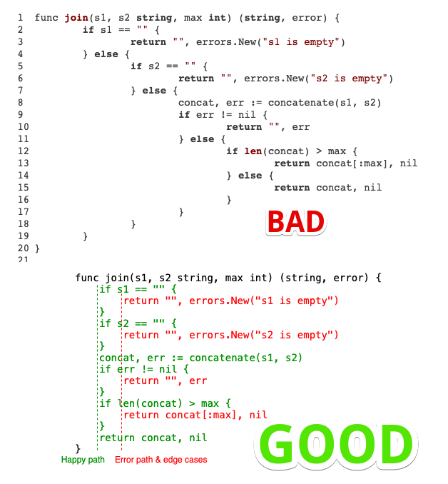

# Самые частые ошибки при сдаче на ревью

> Данный список предназначен для того, что бы вы могли проверить свой код перед передачей его на ревью  
> Супер полезная книжка - [100 ошибок Go и как их избежать](https://www.piter.com/product/100-oshibok-go-i-kak-ih-izbezhat)

- [Самые частые ошибки при сдаче на ревью](#самые-частые-ошибки-при-сдаче-на-ревью)
	- [1. (орг): некорректная форма сдачи домашки](#1-орг-некорректная-форма-сдачи-домашки)
	- [2. (стиль): аргументы одного типа](#2-стиль-аргументы-одного-типа)
	- [3. (стиль): else, сложность кода](#3-стиль-else-сложность-кода)
	- [4. (стиль): имя ресивера у методов](#4-стиль-имя-ресивера-у-методов)
	- [5. (стиль): magic num/phrase магические числа и слова](#5-стиль-magic-numphrase-магические-числа-и-слова)
	- [6. (код): mutex Unlock to defer](#6-код-mutex-unlock-to-defer)
	- [7. (оптимизация): конкатенация строк/слайсов байт](#7-оптимизация-конкатенация-строкслайсов-байт)
	- [8. (стиль): про экспортируемые поля](#8-стиль-про-экспортируемые-поля)
	- [9. (стиль): имена пакетов](#9-стиль-имена-пакетов)
	- [10. (стиль): goimports](#10-стиль-goimports)
	- [11. (стиль): проверка пустой ли слайс](#11-стиль-проверка-пустой-ли-слайс)
	- [12. (стиль): комментарии на русском и не по формату](#12-стиль-комментарии-на-русском-и-не-по-формату)
	- [13. (конкурентность): использовать RWMutex](#13-конкурентность-использовать-rwmutex)
	- [14. (код): break/continue не используют labels](#14-код-breakcontinue-не-используют-labels)
	- [15. (стиль): аббревиатуры с маленькими буквами](#15-стиль-аббревиатуры-с-маленькими-буквами)
	- [16. (стиль): литерал структуры без указания имен полей](#16-стиль-литерал-структуры-без-указания-имен-полей)
	- [17. (стиль): контекст как поле структуры](#17-стиль-контекст-как-поле-структуры)
	- [18. (стиль): именнованные параметры результата](#18-стиль-именнованные-параметры-результата)
	- [19. (конкурентность): анонимные функции в режиме горутин](#19-конкурентность-анонимные-функции-в-режиме-горутин)
	- [20. (стиль): stringer соответсвие интерфейсу](#20-стиль-stringer-соответсвие-интерфейсу)
	- [21. (конкурентность): аксиомы про каналы](#21-конкурентность-аксиомы-про-каналы)
	- [22. (код): использование os.LookupEnv](#22-код-использование-oslookupenv)
	- [23. (код): ioutil](#23-код-ioutil)
	- [24. (код): отмена запущенной job-ы ч/з контекст](#24-код-отмена-запущенной-job-ы-чз-контекст)
	- [25. (код): сигналы ос для прерывания работы](#25-код-сигналы-ос-для-прерывания-работы)
	- [26. (sql): select \*](#26-sql-select-)
	- [27. (sql): List и параметры даты-времени](#27-sql-list-и-параметры-даты-времени)
	- [28. (sql): Поиск по префиксу для этого используем оператор LIKE](#28-sql-поиск-по-префиксу-для-этого-используем-оператор-like)
	- [29. (k8s): k8s labels](#29-k8s-k8s-labels)
	- [30. (API): игнорирование контекста для запросов к предоставляемому API](#30-api-игнорирование-контекста-для-запросов-к-предоставляемому-api)
	- [31. (конкурентность/стиль) Работа с примитивом синхронизации WaitGroup](#31-конкурентностьстиль-работа-с-примитивом-синхронизации-waitgroup)
	- [32. (IO) Доступ к файловым ресурсам](#32-io-доступ-к-файловым-ресурсам)
	- [Вопросы](#вопросы)

## 1. (орг): некорректная форма сдачи домашки

Вам необходимо ознакомиться с материалом по сдаче работы на проверку - [шаг 1.3.3](ссылка на соответствующий урок в курсе)
Ждем ссылку на Merge Request! Спасибо.

## 2. (стиль): аргументы одного типа

Аргументы одного типа можно перечислять через запятую, а тип указывать в конце

```go
func Foo(a string, b string) -> func Foo(a, b string)
```

## 3. (стиль): else, сложность кода

Блок else редко исп на практике т.к. усложняет код, в основном стараются завершить функцию или продолжить цикл



## 4. (стиль): имя ресивера у методов

Так называемый ресивер у методов лучше называть короче, обычно это первая согласная или набор первых согласных для сложных имен. Так же тип ресивера должен быть одного типа или значение или указатель, [но миксовать не надо](https://go.dev/tour/methods/8), так как это разные типы данных. Вот [тут](https://go.dev/tour/methods/9) написано почему.  
Литература: "Язык программирования Go" Алан А.А.Донован, Брайан У.Керниган 2016г.: Глава 6, параграфы 2;

## 5. (стиль): magic num/phrase магические числа и слова

[магическое число](https://ru.wikipedia.org/wiki/%D0%9C%D0%B0%D0%B3%D0%B8%D1%87%D0%B5%D1%81%D0%BA%D0%BE%D0%B5_%D1%87%D0%B8%D1%81%D0%BB%D0%BE_(%D0%BF%D1%80%D0%BE%D0%B3%D1%80%D0%B0%D0%BC%D0%BC%D0%B8%D1%80%D0%BE%D0%B2%D0%B0%D0%BD%D0%B8%D0%B5))

Лучше создавать константы со значимыми именами и их использовать

## 6. (код): mutex Unlock to defer

Разблокировку мьютекса лучше делать через defer, это хорошая привычка, т.к. может возникнуть ситуация когда вы блокировку поставили, но возникла паника и вы не успели снять блокировку, а произошел recover и у вас deadlock.

## 7. (оптимизация): конкатенация строк/слайсов байт

Объединение строк - всегда создание новой строки.

```go
func concat(values []string) string {
	s := ""
	for _, value := range values {
		s += value // самое проблемное место - выделение новой памяти для новой строки
	}
	return s
}

// optimized

func concatOpt(values []string) string {
	sb := strings.Builder{}
	for _, value := range values {
		_, _ = sb.WriteString(value)
	}
	return sb.String()
}

// more optimized

func concatJoin(values []string) string {
	return strings.Join(values, "")
}

// Benchmark для строк типа 

var str = []string{"alfaalfaalfaalfaalfa", "omegaomegaomegaomegaomegaomega", "alfaalfaalfaalfaalfa", "omegaomegaomegaomegaomegaomega", "alfaalfaalfaalfaalfa", "omegaomegaomegaomegaomegaomega", "alfaalfaalfaalfaalfa", "omegaomegaomegaomegaomegaomega", "alfaalfaalfaalfaalfa", "omegaomegaomegaomegaomegaomega", "alfaalfaalfaalfaalfa", "omegaomegaomegaomegaomegaomega", "alfaalfaalfaalfaalfa", "omegaomegaomegaomegaomegaomega", "alfaalfaalfaalfaalfa", "omegaomegaomegaomegaomegaomega", "alfaalfaalfaalfaalfa", "omegaomegaomegaomegaomegaomega", "alfaalfaalfaalfaalfa", "omegaomegaomegaomegaomegaomega", "alfaalfaalfaalfaalfa", "omegaomegaomegaomegaomegaomega", "alfaalfaalfaalfaalfa", "omegaomegaomegaomegaomegaomega"}

func Benchmark_concat(b *testing.B) {
	for i := 0; i < b.N; i++ {
		concat(str)
	}
}

func Benchmark_concatOpt(b *testing.B) {
	for i := 0; i < b.N; i++ {
		concatOpt(str)
	}
}

func Benchmark_concatJoin(b *testing.B) {
	for i := 0; i < b.N; i++ {
		concatJoin(str)
	}
}

/*
Benchmark_concat-4   	  429014	      2553 ns/op	    7776 B/op	      23 allocs/op
Benchmark_concatOpt-4    1575224	     763.3 ns/op	    1880 B/op	       6 allocs/op
Benchmark_concatJoin-4   2891371	     408.6 ns/op	     640 B/op	       1 allocs/op
*/
```

P.S. у пакета bytes реализованы практически теже методы для работы со слайсами байт

## 8. (стиль): про экспортируемые поля

Плохой практикой считается делать поля экспортируемыми, так вы даете возможность обращаться к ним из других пакетов, что может стать источником проблем. Поэтому экспортируемыми делают чаще методы и безопасные/необходимые для изменения поля.

Все, что экспортируемо - считайте контрактом вашего пакета, а чем больше пунктов в контракте, тем сложнее его изменять в будущем.
При этом важно помнить, что неэкспортируемые поля не обрабатываются `json.Marshal|Unmarshal`. Для решения этой проблемы можно воспользоваться хаком - реализовать интерфейсы `json.Marshaler` и `json.Unmarshaler`

```go
package main

import (
	"encoding/json"
	"fmt"
	"log"
)

var eventBts = []byte(`{"id": "123", "message": "custom json enc/dec"}`)

type EventOne struct {
	id      string
	Message string
}

type EventTwo struct {
	id      string
	Message string
}

func (e *EventTwo) MarshalJSON() ([]byte, error) {
	return json.Marshal(
		struct { // Создание анонимной структуры
			ID      string `json:"id"`
			Message string `json:"message"`
		}{
			ID:      e.id,
			Message: e.Message,
		},
	)
}

func (e *EventTwo) UnmarshalJSON(b []byte) error {
	var tempE struct { // Создание переменной с типом анонимной структуры
		ID      string `json:"id"`
		Message string `json:"message"`
	}
	if err := json.Unmarshal(b, &tempE); err != nil {
		return err
	}

	e.id = tempE.ID
	e.Message = tempE.Message
	return nil
}

func main() {
	var e1 EventOne
	var e2 EventTwo

	if err := json.Unmarshal(eventBts, &e1); err != nil {
		log.Fatalf("unmarshal e1 error: %s", err)
	}
	if err := json.Unmarshal(eventBts, &e2); err != nil {
		log.Fatalf("unmarshal e2 error: %s", err)
	}

	fmt.Printf("e1: %+#v\n", e1)
	fmt.Printf("e2: %+#v\n", e2)

	// marshal
	e11 := EventOne{id: "111", Message: "messageOne"}
	e22 := &EventTwo{id: "222", Message: "messageTwo"}

	bts11, err := json.Marshal(e11)
	if err != nil {
		log.Fatalf("marshal e11 error: %s", err)
	}
	bts22, err := json.Marshal(e22)
	if err != nil {
		log.Fatalf("marshal e22 error: %s", err)
	}

	fmt.Printf("e11: %s\n", bts11)
	fmt.Printf("e22: %s\n", bts22)
}

/*
Output:
e1: main.EventOne{id:"", Message:"custom json enc/dec"}
e2: main.EventTwo{id:"123", Message:"custom json enc/dec"}
e11: {"Message":"messageOne"}
e22: {"id":"222","message":"messageTwo"}
*/
```

## 9. (стиль): имена пакетов

[golang package names](https://go.dev/blog/package-names)

## 10. (стиль): goimports

В начале группируются все пакеты стандартной библиотеки, а затем все сторонние пакеты группируются ч/з пустую строку. Это упрощает чтение и понимание состава используемых пакетов. [src](https://www.digitalocean.com/community/tutorials/importing-packages-in-go-ru)

## 11. (стиль): проверка пустой ли слайс

```go
slice == nil -> len(slice) == 0
```

Правильнее всего проверять слайс пустой он или нет именно по его длине, эта проверка покрывает случае когда слайс пустой и когда слайс=nil, в то время когда проверка на nil пустой слайс `[]any{} != nil` пропустит

## 12. (стиль): комментарии на русском и не по формату

рекоммендация, писать комментарии:

- полное предложение, тогда godoc сгенерирует красивую документацию
- начинаем с имени описываемой сущности
- в конце точка

[comment-sentences](https://github.com/golang/go/wiki/CodeReviewComments#comment-sentences)

## 13. (конкурентность): использовать RWMutex

Если в защищаемой мьютексом структуре больше операций на чтения чем на запись, то принято использовать [RWMutex](https://pkg.go.dev/sync#RWMutex), тогда на чтение блокировка возможна для нескольких (см. Донован гл 9.3)

## 14. (код): break/continue не используют labels

https://medium.com/golangspec/labels-in-go-4ffd81932339

```go
for i:=0; i < 5; i++ {
	fmt.Printf("%d\n", i)

	switch i {
		default:
			// some code
		case 2:
		    break // ожидаем, что остановит цикл если i = 2, но так не работает - прервет switch
	}
}
```

надо/можно вот так:

```go
loop:
	for i:=0; i < 5; i++ {
		fmt.Printf("%d\n", i)

		switch i {
			default:
				// some code
			case 2:
				break loop // ожидаем, что остановит цикл если i = 2 так работает!
		}
	}
```

## 15. (стиль): аббревиатуры с маленькими буквами

в гошке принято называть переменные в имена которых включены аббревиатуры большими буквами - Id -> ID, Json -> JSON и так далее - https://github.com/golang/go/wiki/CodeReviewComments#initialisms

## 16. (стиль): литерал структуры без указания имен полей

такой литерал объявления структуры редко используется на практике, т.к. у него есть ряд недостатков:

- надо знать и помнить состав, тип и порядок полей в структуре
- это надо знать не только вам, но и тому, кто будет читать ваш код (вы тоже, через время, можете забыть что там внутри)
- при внесении изменений в состав структуры надо будет вносить изменения и сюда (в конструктор), даже если они и не касаются данной области

## 17. (стиль): контекст как поле структуры

https://go.dev/blog/context-and-structs

## 18. (стиль): именнованные параметры результата

Называя выходные параметры вы расширяете варианты ошибок и усложнение понимания кода:

- почему усложняет: если функция достаточно большая, то пустой return путает
- вариант ошибки - код ниже

```go
func (l loc) getCoordinates(ctx context.Context, address string) (lat, lng float32, err error) {
        isValid := l.validateAddress(address)
        if !isValid {
                return 0, 0, errors.New("invalid address")
        }

        if ctx.Err() != nil {
                return 0, 0, err // тут всегда будет nil, потому что тупо забыли присвоить err значение ошибки, а оно инициировалояь уже со значением по умолчанию
                // а если бы не был назван выходной параметр, то тут просто не скомпилировалось бы - т.к. переменной err не существует
        }

        // Get and return coordinates
}
```

однако, пара вариантов когда полезно

- когда ситуация как в одном из заданий - вернуть текст ошибки при возникновении паники, тогда при бработке recover() в defer-e установка именнованного выходного параметра делает возможным его выполнение
- когда у вас возвращается несколько однотипных параметров и надо дать понять какой из них что означает, пример ниже
- https://github.com/golang/go/wiki/CodeReviewComments#named-result-parameters

```go
type locator interface {
        getCoordinates(address string) (float32, float32, error)
}
// или
type locator interface {
        getCoordinates(address string) (lat, lng float32, err error)
}
```

## 19. (конкурентность): анонимные функции в режиме горутин

анонимные функции в режиме горутин - коварная вещь, рекомендуется передавать им явно аргументы:

```go
func main() {
	for i := 0; i < 5; i++ {
		go func() {
			fmt.Printf("print: %d\n", i)
		}()
	}
	time.Sleep(time.Second)
}

// выведет
/*
print: 5
print: 5
print: 5
print: 5
print: 5
*/

// решение

func main() {
	for i := 0; i < 5; i++ {
		go func(i int) {
			fmt.Printf("print: %d\n", i)
		}(i)
	}
	time.Sleep(time.Second)
}
```

## 20. (стиль): stringer соответсвие интерфейсу

https://pkg.go.dev/fmt#Stringer

https://go.dev/play/p/sb0ccxZp63F

```go
package main

import (
	"fmt"
	"strconv"
	"strings"
)

type custom map[int]float64

func (c custom) String() string {
	res := make([]string, len(c))
	i := 0
	for k, v := range c {
		res[i] = strconv.Itoa(k) + " - " + strconv.FormatFloat(v, 'g', -1, 64)
		i++
	}
	return strings.Join(res, "\n")
}

func main() {
	c := custom{
		1: 1.11111,
		2: 2.22222,
		3: 3.33333,
	}
	fmt.Println(c) 
	/*
		3 - 3.33333
		1 - 1.11111
		2 - 2.22222
	*/
}
```

## 21. (конкурентность): аксиомы про каналы

https://dave.cheney.net/2014/03/19/channel-axioms

This post explores four of the less common properties of channels:

- A send to a nil channel blocks forever
- A receive from a nil channel blocks forever
- A send to a closed channel panics
- A receive from a closed channel returns the zero value immediately

| operation | nil channel   | closed channel | not-closed, not-nil channel |
| :-------- | :------------ | :------------- | :-------------------------- |
| close     | panic         | panic          | OK                          |
| send      | block forever | panic          | block or send               |
| receive   | block forever | never block    | block or receive            |

## 22. (код): использование os.LookupEnv

данная функция возвращает значение переменной и факт ее установки, но не гарантирует, что полученное значение будет не пустым, см пример в самом пакете os и описание функции
"LookupEnv <...>. If the variable is present in the environment the value (which may be empty) is returned and the boolean is true. <...>"
https://pkg.go.dev/os#LookupEnv

## 23. (код): ioutil

`ioutil` - **[DEPRECATED](https://pkg.go.dev/io/ioutil)**, используйте эти же функции в самом пакете `io`

## 24. (код): отмена запущенной job-ы ч/з контекст

Как останавливать запущенные джобы - [пример](https://gist.github.com/art-frela/b1c44d9674325fd4ae899fd9eb0b6cc7)

## 25. (код): сигналы ос для прерывания работы

```go
ctx, stop := signal.NotifyContext(context.Background(), os.Interrupt, syscall.SIGTERM)
defer stop()

// some code

<-ctx.Done() // wait signal for interrupt
// graceful shutdown
```

## 26. (sql): select *

`select *`- антипаттерн, что-то изменится в базе и будет ошибка тут, совет общего плана помогает практически во всех случаях - запрашивайте те поля, которые вам нужны.

## 27. (sql): List и параметры даты-времени

Для параметров типа дата-время лучше подходит тип данных time.Time, проще управлять форматом и можно не валидировать.  
Драйвер github.com/jackc/pgx корректно совмещает типы go и postgres-a timestamp/timestamptz и time.Time  

По запросу метода List - для упрощения пострения запроса рекомендую сделтаь запрос константой и настраивать сами параметры в соответсвии с аргуметами метода, например:

- если параметр From не заполнен, то брать начало текущего дня или 10 минут назад от текущего времени
- если To не заполнен, то брать текущее время
- а с name еще проще `"name" like $1|2|3` при этом сам параметр `filterName := filter.Name + "%"` - тогда будет если там пустая строка то выберет все

## 28. (sql): Поиск по префиксу для этого используем оператор LIKE

Индекс BTree, в его стандартной конфигурации, не может быть использован для поиска по префиксу. В индексе для каждого столбца можно дополнительно задать [Operator Classes](https://www.postgresql.org/docs/current/indexes-opclass.html) (классы операторов, которые определяют операции, поддерживаемые индексом). Опция text_pattern_ops позволяет сделать BTree индекс пригодным для использования в запросах на поиск префикса.
Незначительные нюансы, которые нужно учитывать: класс операторов text_pattern_ops подходит для поиска по префиксу (like ‘text%’) и поиска по равенству (=). Но не поддерживает применение индекса для SQL запросов, в которых используются сравнения <, <=, > и >=. Чтобы ускорить и такую категорию запросов, нужно создать доп. индекс с классом операторов по умолчанию.

## 29. (k8s): k8s labels

имена меток желательно приводить к рекомендациям, дабы ожидаемо было - https://kubernetes.io/ru/docs/concepts/overview/working-with-objects/common-labels/

## 30. (API): игнорирование контекста для запросов к предоставляемому API

Контекст надо использоваь если есть такая возможность. Это возможность отмены запроса. Пользователь отменил веб запрос, а у вас запрос продолжает выполняться - в пустую!

`QueryRowContext`, `ExecContext`, `QueryContext`

## 31. (конкурентность/стиль) Работа с примитивом синхронизации WaitGroup

WaitGroup - примитив синхронизации, обеспечивающий ожидание завершения запущенных горутин. Его можно передавать как каждой функции, которая будет запущена в отдельной горутине, так и оперировать над ней в анонимной горутине. Второй способ обладает такими преимуществами, как:

1. Каждая функция ответственна за свой функционал (SRP), вызываемой функции не следует обеспечивать синхронизацию, если это не ее явная зона ответственности
2. Управление синхронизацией находится в одном месте, что позволяет избежать потенциальных ошибок и облегчить отладку
3. Функция может быть использована неконкурентно

```go
func print(i int) {
    fmt.Println(i) 
}

func Print(valuesToBePrinted []int) {
    wg := &sync.WaitGroup{}
	wg.Add(len(valuesToBePrinted))
    for i := 0; i < len(valuesToBePrinted); i++ {
        go func(i int) {
            defer wg.Done()
            print(i)
        }(i)
    }
    wg.Wait()
}
```

## 32. (IO) Доступ к файловым ресурсам

Довольно частая ошибка, допускаемая студентами - неверно указанный путь к файлу. Он должен быть указан относительно той директории, где находится собранный исполняемый файл.

## Вопросы

> Нормально ли запускать горутину в горутине ?

Да, главное всегда придерживаться правила, **перед тем как запустить горутину четко понимать как она будет остановлена**
